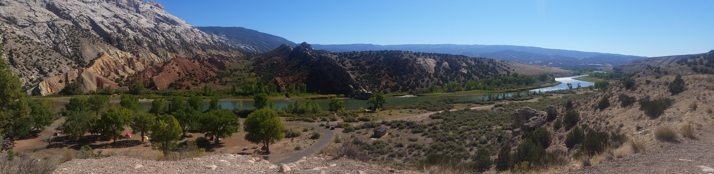

<picture>
  
</picture>
<h1 align="center">About Me</h1>

<a href="https://adelei.co.uk/">Portfolio</a> . <a href="https://adelei.co.uk/journal/">Blog</a> . <a href="https://www.linkedin.com/in/nicola-adele-simmonds/)">LinkedIn</a>

I’m a front end developer (and web designer) with a passion for the web and accessibility. A career switcher after 10+ years working for member-led organisation I have spent the last couple of years developing my front end development and web design skills which includes a Masters Degree from the University of Greenwich in Web Design and Content Planning.

## My Technical Skills Include:
- HTML and CSS
- Wordpress Theme Development
- Wordpress Plug-in Development
- Vanilla JavaScript

## The Web is For Everyone
<picture>
  
</picture>
Something that gives me goosebumps every time is the image from the 2012 Olympic Games. Where "this is for everyone" is emblazoned across the stadium whilst Tim Berners Lee is centre stage apparently live tweeting this on a computer. This sums up what Tim Berners Lee envisioned for the web and this is an ideology I wholeheartedly support. I make an effort to ensure that all of my projects are contributing to a web that is for everyone.

## Some things I like to read about and include in my projects are:
- W3C and WCAG
- Accessibility
- Content First Designing/Development
- User Centred Design
- User Experience Design
- Vanilla JavaScript
- Vanilla Wordpress Themes

